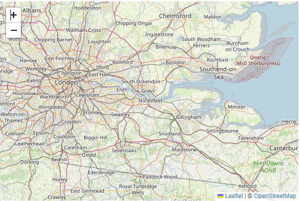

### Include Leaflet CSS file in the head section of your document:

    <link rel="stylesheet" href="https://unpkg.com/leaflet@1.8.0/dist/leaflet.css"/>

### Include Leaflet JavaScript file after Leaflet’s CSS:
    <!-- Make sure you put this AFTER Leaflet's CSS -->
    

### Put a div element with a certain id where you want your map to be:

    

### Make sure the map container has a defined height, for example by setting it in CSS:

    #map { height: 180px; }

### Setting up the map

Let’s create a map of the center of London with pretty OpenStreetMap tiles. From here on, we’ll be working in JS. First we’ll initialize the map and set its view to our chosen geographical coordinates and a zoom level:

    var map = L.map('map').setView([51.505, -0.09], 13);

    L.tileLayer('https://{s}.tile.openstreetmap.org/{z}/{x}/{y}.png', {
    maxZoom: 19,
    attribution: '© OpenStreetMap'
    }).addTo(map);

### Tile layers 
    googleStreets = L.tileLayer('http://{s}.google.com/vt?lyrs=m&x={x}&y={y}&z={z}',{
    maxZoom: 20,
    subdomains:['mt0','mt1','mt2','mt3']
    });

    googleHybrid = L.tileLayer('http://{s}.google.com/vt?lyrs=s,h&x={x}&y={y}&z={z}',{
    maxZoom: 20,
    subdomains:['mt0','mt1','mt2','mt3']
    });

    googleSat = L.tileLayer('http://{s}.google.com/vt?lyrs=s&x={x}&y={y}&z={z}',{
    maxZoom: 20,
    subdomains:['mt0','mt1','mt2','mt3']
    });

    googleTerrain = L.tileLayer('http://{s}.google.com/vt?lyrs=p&x={x}&y={y}&z={z}',{
    maxZoom: 20,
    subdomains:['mt0','mt1','mt2','mt3']
    });

### Markers, circles, and polygons
    var marker = L.marker([51.5, -0.09]).addTo(map);

    var circle = L.circle([51.508, -0.11], {
    color: 'red',
    fillColor: '#f03',
    fillOpacity: 0.5,
    radius: 500
    }).addTo(map);

    var polygon = L.polygon([
    [51.509, -0.08],
    [51.503, -0.06],
    [51.51, -0.047]
    ]).addTo(map);

### Working with popups

    marker.bindPopup("<b>Hello world!</b> I am a popup.").openPopup();
    circle.bindPopup("I am a circle.");
    polygon.bindPopup("I am a polygon.");
